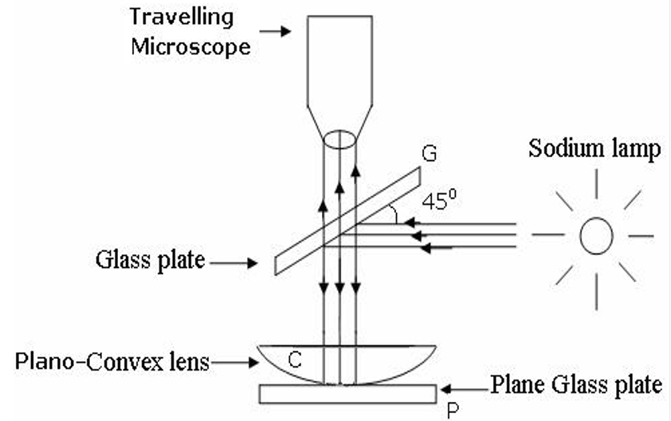
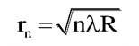
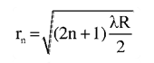
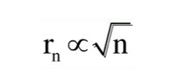
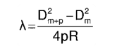
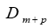
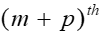
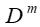
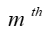

Theory of Newton’s Rings
Newton's Rings is a phenomenon that arises due to the interference of light. When a Plano-convex lens is placed on a flat glass plate, a thin air film is formed between the two surfaces. The thickness of this air film varies radially, being zero at the point of contact between the lens and the glass plate and increasing outward. When monochromatic light is incident on the lens, interference occurs between the light rays reflected from the top and bottom surfaces of the air film.

Interference Mechanism
Reflected Rays:

A portion of the incident light is reflected at the air-lens interface, and another portion is reflected at the air-glass interface. These two reflected rays have a path difference due to the varying thickness of the air film.
Phase Change:

When light is reflected from a denser medium (e.g., air to glass), a phase change of π (or half a wavelength) occurs. This phase shift plays a crucial role in determining whether constructive or destructive interference occurs.
Constructive and Destructive Interference:

Bright Rings (Constructive Interference): Occur when the path difference between the two rays is an integral multiple of the wavelength (
2
𝑡
=
𝑚
𝜆
2t=mλ).
Dark Rings (Destructive Interference): Formed when the path difference is an odd multiple of half the wavelength (
2
𝑡
=
(
2
𝑚
−
1
)
𝜆
2
2t=(2m−1) 
2
λ
​
 ).
Characteristics of Newton’s Rings
Concentric Circular Rings:

The interference pattern consists of alternate bright and dark concentric circular rings with the center being either bright or dark, depending on the conditions of interference.
Radius of Rings:

The radius of each ring depends on the radius of curvature of the lens, the order of the ring, and the wavelength of the light used.
Monochromatic Light:

When monochromatic light is used, the rings appear alternately dark and bright.
Polychromatic Light:

When white light is used, each ring appears as a series of colored fringes due to the superposition of different wavelengths.
Practical Applications of Newton’s Rings
Measurement of Wavelength:

Newton’s Rings can be used to determine the wavelength of monochromatic light by measuring the radii of the rings and using the corresponding formula.
Determination of Refractive Index:

By filling the air gap with a liquid, the refractive index of the liquid can be calculated.
Testing Optical Components:

The uniformity of a lens surface can be checked by observing the symmetry of the interference pattern.
Radius of Curvature:

The radius of curvature of the lens can be accurately determined using the measured diameters of the rings.
Factors Affecting Newton’s Rings
Wavelength of Light:

The spacing between the rings is proportional to the wavelength of the incident light. Larger wavelengths result in wider rings.
Radius of Curvature:

A lens with a larger radius of curvature produces a wider spacing between the rings.
Medium Between the Surfaces:

Replacing air with a liquid of higher refractive index reduces the spacing between the rings, as the effective wavelength in the medium decreases.
Inclination of the Light Source:

Perfectly normal incidence of light produces symmetric rings. A slight tilt in the light source distorts the symmetry.

  

<h4>FORMULAE:-</h4>

1. Radii of nth dark ring:   

  

2.Radii of nth bright ring:

  

3.Radius of dark ring is proportional to the radius of curvature of the lens by the relation,

  

4.The wavelength of monochromatic light can be determined as:

  

Where, 
 is the diameter of the
 dark ring                
     is the diameter of the       dark ring.       

    
