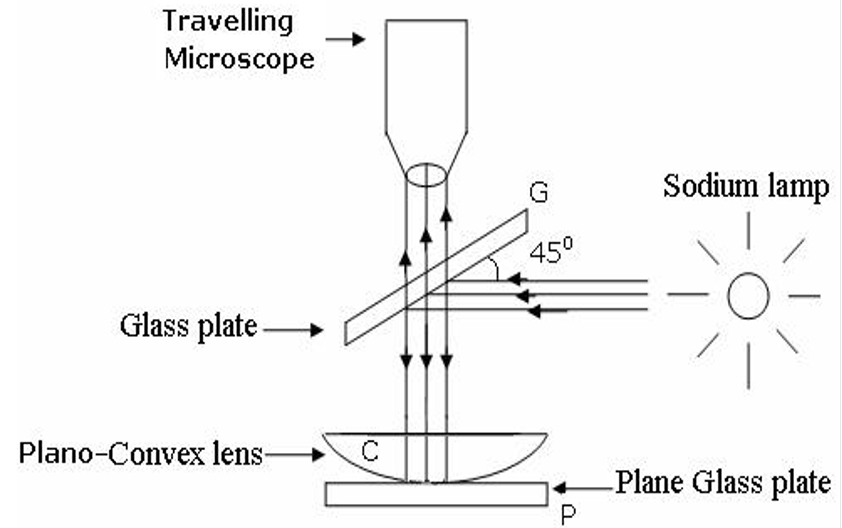
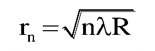
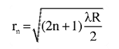
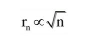
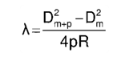
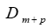
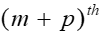
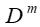
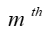

1. Newton’s rings have equal thickness between them. If we have a flat glass slab and then we place a Plano- convex lens on it , then the gap behaves like a thin air film. 
2. Now if a monochromatic light falls on the Plano- convex surface, then one light is reflected by the glass slab and the other by the plano-convex lens.
3. These two rays interfere with each other giving a pattern.Now if the light is normally incident on the plano-convex surface, it will result in two reflected rays one given out by the glass slab and the other given out by the plano-convex surface respectively.
4. This will result in an interference pattern which are a series of bright and dark concentric coloured bands observed between the plano-convex surface and the glass slab. These are called Newton’s rings.
  

<h4>FORMULAE:-</h4>

1. Radii of nth dark ring:   

  

2.Radii of nth bright ring:

  

3.Radius of dark ring is proportional to the radius of curvature of the lens by the relation,

  

4.The wavelength of monochromatic light can be determined as:

  

Where, 
 is the diameter of the
 dark ring                
     is the diameter of the       dark ring.       

    
